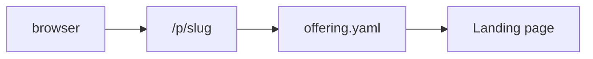
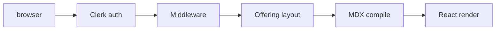
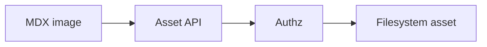
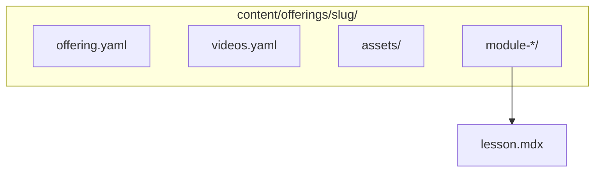

# Architecture

Technical overview of the course platform: content model, routing, rendering, and trust boundaries. Related: [Auth and visibility](./auth-and-visibility.md), [MDX authoring](./mdx-authoring.md), [Content layout](./content-layout.md).

## Diagrams

### Public request flow

### Private lesson flow

### Asset flow

### Content structure

## Offerings

An **offering** is a directory under `content/offerings/<offeringSlug>/` containing:

- `offering.yaml` — metadata, module tree, lesson slugs/titles ([content layout](./content-layout.md))
- Optional `videos.yaml` — hosted video registry
- Optional `assets/` — filesystem binaries served via authenticated API
- `module-*/*.mdx` — lesson sources

The **`format`** field (`course`, `webinar`, `workshop`, `mini-course`) is metadata for dashboards and grouping; runtime behavior is the same across formats.

## Public vs private routes

| Prefix | Auth | Content |
|--------|------|---------|
| `/p/[offeringSlug]` | None | YAML-derived landing only (syllabus titles); no lesson MDX |
| `/dashboard`, `/offerings/*` | Clerk + [`students.yaml`](../config/students.yaml) | Portal UI, lesson MDX, sidebar |

See [Auth and visibility](./auth-and-visibility.md) for middleware, `visibility`, and failure modes (404/403).

## MDX rendering

- Lessons are loaded from disk as strings and compiled with [`next-mdx-remote/rsc`](https://github.com/hashicorp/next-mdx-remote) in [`app/offerings/[offeringSlug]/[lessonSlug]/page.tsx`](../app/offerings/%5BofferingSlug%5D/%5BlessonSlug%5D/page.tsx).
- `remark-directive`, custom callout/details handling, `remark-math`, and `rehype-katex` run in the compile pipeline.
- **rehype-slug** assigns heading `id`s; **rehype-autolink-headings** adds hover permalinks on **`h2`** and **`h3`** only (`h1` keeps `id`, no permalink chip).
- Markdown links use [`MdxAnchor`](../components/mdx/MdxAnchor.tsx) to resolve `lesson:` / `offering:` pseudo-URLs (including optional `#fragment`); see [MDX authoring](./mdx-authoring.md).
- KaTeX CSS is loaded from the root layout.

Author-facing detail: [MDX authoring](./mdx-authoring.md).

## Interactive components

Lesson MDX maps tag names to React components (calculator, `VideoPlayer`, `Quiz`, images, downloads). Client components hydrate for interactivity; lesson compilation stays server-side.

Constraints from `next-mdx-remote` (e.g. stripped JSX expression attributes) affect authoring — see [MDX authoring](./mdx-authoring.md).

## Clerk

Clerk provides authentication. The app uses publishable + secret keys in `.env.local`; middleware runs `auth.protect()` on private route prefixes.

Setup and env vars: [Auth and visibility](./auth-and-visibility.md).

## Students allowlist

[`config/students.yaml`](../config/students.yaml) maps normalized emails to allowed offering slugs. Authorization helpers live in [`lib/authz.ts`](../lib/authz.ts) and [`lib/students.ts`](../lib/students.ts). No sync step: edits apply on next request.

## Asset flow

1. Lesson MDX may reference `../assets/...` or `<CourseImage />`; URLs are rewritten to `/api/offering-assets/[offeringSlug]/...`.
2. The API route validates Clerk session and allowlist, resolves paths under the offering’s `assets/` directory, and streams files.

Unauthorized requests receive 401/403; lesson bodies never bypass this for filesystem assets.

## Visibility model

`offering.yaml` may set `visibility`: `private` \| `public` \| `unlisted`. Omitted implies `private`. This controls whether `/p/[slug]` renders (public/unlisted) or returns 404 (private). It does **not** relax `/offerings/*`; enrolled access remains Clerk + `students.yaml`.

`published` is validated but has **no runtime effect** today.

Full semantics: [Auth and visibility](./auth-and-visibility.md).

## Git-native architecture

- **Source of truth:** repository files (`content/`, `config/students.yaml`), not a database.
- **Deployment assumption:** content ships with the app build or deployment artifact; dynamic edits require redeploy or external sync (out of scope here).
- **Operational tradeoff:** simple auditing and review via Git; scaling authoring concurrency is manual.

## See also

- [Auth and visibility](./auth-and-visibility.md)
- [Content layout](./content-layout.md)
- [MDX authoring](./mdx-authoring.md)
