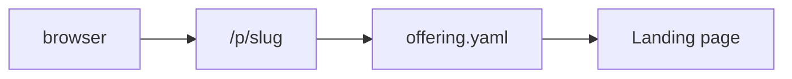
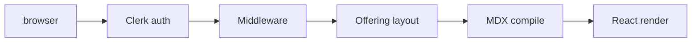
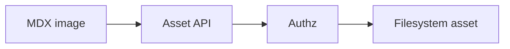
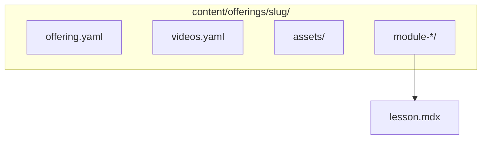

# Architecture

Technical overview of the course platform: content model, routing, rendering, and trust boundaries. Related: [Auth and visibility](./auth-and-visibility.md), [MDX authoring](./mdx-authoring.md), [Content layout](./content-layout.md), [Admin authoring](./admin-authoring.md).

## Diagrams

### Public request flow

### Private lesson flow

### Asset flow

### Content structure

## Offerings

An **offering** is a directory under `content/offerings/<offeringSlug>/` containing:

- `offering.yaml` — metadata, module tree, lesson slugs/titles ([content layout](./content-layout.md))
- Optional `videos.yaml` — hosted video registry
- Optional `assets/` — filesystem binaries served via authenticated API
- `module-*/*.mdx` — lesson sources

The **`format`** field (`course`, `webinar`, `workshop`, `mini-course`) is metadata for dashboards and grouping; runtime behavior is the same across formats.

## Public vs private routes

| Prefix | Auth | Content |
|--------|------|---------|
| `/p/[offeringSlug]` | None | YAML-derived landing only (syllabus titles); no lesson MDX |
| `/s/[siteSlug]`, `/s/[siteSlug]/[pageSlug]` | None | Simple site pages from `content/sites/` when `site.yaml` `visibility` is `public` or `unlisted`; **`private`** → **404** |
| `/dashboard`, `/offerings/*` | Clerk + [`students.yaml`](../config/students.yaml) | Portal UI, lesson MDX, sidebar |

See [Auth and visibility](./auth-and-visibility.md) for middleware, `visibility`, and failure modes (404/403).

## Sites (phase 1)

A **site** is a directory under **`content/sites/<siteSlug>/`** with **`site.yaml`** and **`pages/*.mdx`** (home is **`pages/index.mdx`** → **`/s/<siteSlug>`**). Validated and loaded by [`lib/sites.ts`](../lib/sites.ts). Public MDX uses a **minimal** compile helper [`lib/mdx-site-compile.tsx`](../lib/mdx-site-compile.tsx) (markdown, math, callouts/details — no lesson-only components or site assets API yet). Admin read-only UI: **`/admin/sites`**, **`/admin/sites/[siteSlug]`**, gated by optional **`sites`** rows in [`config/admins.yaml`](../config/admins.yaml).

## Search

### Offering-scoped search

- Path: **`/offerings/[offeringSlug]/search`** (`?q=` query). Implemented in [`app/offerings/[offeringSlug]/search/page.tsx`](../app/offerings/%5BofferingSlug%5D/search/page.tsx).
- **Auth:** Same as other `/offerings/*` routes (Clerk + [`students.yaml`](../config/students.yaml)); the offering layout runs before the search page.
- **Index:** Built per request with [`MiniSearch`](https://github.com/lucaong/minisearch) from lesson MDX on disk ([`lib/offering-search.ts`](../lib/offering-search.ts)), cached for the lifetime of the React request cache ([`React.cache`](https://react.dev/reference/react/cache)). Fields include lesson title, module title, markdown headings (outside fenced blocks), stripped lesson text, and **text inside fenced code blocks** (fence lines removed; code remains searchable — see [`lib/offering-search-text.ts`](../lib/offering-search-text.ts)).
- **No global or cross-offering search** in this design; no separate search database.

The reserved URL segment **`search`** is documented with slug rules in [Content layout — Slug rules](./content-layout.md#slug-rules).

## Admin authoring (scaffolding)

- **Routes:** **`/admin`**, **`/admin/offerings`**, **`/admin/offerings/[offeringSlug]`**, **`/admin/offerings/[offeringSlug]/lessons/[lessonSlug]/preview`**, **`/admin/sites`**, **`/admin/sites/[siteSlug]`** ([`app/admin/`](../app/admin/)).
- **Auth:** Clerk (middleware) plus **[`config/admins.yaml`](../config/admins.yaml)** — offering-scoped **`owner`** \| **`editor`** \| **`viewer`** rows and optional **site-scoped** **`sites`** (omit → no site admin access); helpers in [`lib/admin-auth.ts`](../lib/admin-auth.ts) / [`lib/admins.ts`](../lib/admins.ts). **`"*"`** in `offerings` or `sites` means all entries of that kind (typical for owners).
- **Content access:** [`ContentRepository`](../lib/content-repository/types.ts) + [`GitContentRepository`](../lib/content-repository/git-content-repository.ts) wrap [`lib/offerings.ts`](../lib/offerings.ts) for admin reads; learner lesson routes still load sources via `offerings` directly.
- **Lesson MDX compile:** shared helper [`lib/mdx-lesson-compile.tsx`](../lib/mdx-lesson-compile.tsx) (`compileLessonMdxContent`) keeps learner and admin preview on the same remark/rehype + component map; admin-only HTML serialization lives in [`lib/mdx-lesson-preview-serialize.tsx`](../lib/mdx-lesson-preview-serialize.tsx) (temporary skeleton — [Admin authoring](./admin-authoring.md)).

Full roadmap (preview pipeline, Git publishing, future DB/repo backends): [Admin authoring](./admin-authoring.md).

## MDX rendering

- **Offerings:** Lessons are loaded from disk as strings and compiled through [`compileLessonMdxContent`](../lib/mdx-lesson-compile.tsx) ([`next-mdx-remote/rsc`](https://github.com/hashicorp/next-mdx-remote)) from [`app/offerings/[offeringSlug]/[lessonSlug]/page.tsx`](../app/offerings/%5BofferingSlug%5D/%5BlessonSlug%5D/page.tsx).
- **Sites:** Pages use [`compileSitePageMdx`](../lib/mdx-site-compile.tsx) from [`app/s/[siteSlug]/page.tsx`](../app/s/%5BsiteSlug%5D/page.tsx) (restricted component map; phase&nbsp;1 — no `CourseImage`, videos, quizzes, or asset pipeline).
- `remark-directive`, custom callout/details handling, `remark-math`, and `rehype-katex` run in **both** lesson and site compile pipelines (sites use a smaller component map — see [`lib/mdx-site-compile.tsx`](../lib/mdx-site-compile.tsx)).
- **rehype-slug** assigns heading `id`s; **rehype-autolink-headings** adds hover permalinks on **`h2`** and **`h3`** only (`h1` keeps `id`, no permalink chip).
- **Lessons:** Markdown links use [`MdxAnchor`](../components/mdx/MdxAnchor.tsx) to resolve `lesson:` / `offering:` pseudo-URLs (including optional `#fragment`); see [MDX authoring](./mdx-authoring.md).
- **Sites:** Plain Markdown links only in phase&nbsp;1 (no `lesson:` / `offering:` resolver on `/s/*`).
- KaTeX CSS is loaded from the root layout.

Author-facing detail: [MDX authoring](./mdx-authoring.md).

## Interactive components

Lesson MDX maps tag names to React components (calculator, `VideoPlayer`, `Quiz`, images, downloads). Client components hydrate for interactivity; lesson compilation stays server-side.

Constraints from `next-mdx-remote` (e.g. stripped JSX expression attributes) affect authoring — see [MDX authoring](./mdx-authoring.md).

## Clerk

Clerk provides authentication. The app uses publishable + secret keys in `.env.local`; middleware runs `auth.protect()` on private route prefixes.

Setup and env vars: [Auth and visibility](./auth-and-visibility.md).

## Students allowlist

[`config/students.yaml`](../config/students.yaml) maps normalized emails to allowed offering slugs. Authorization helpers live in [`lib/authz.ts`](../lib/authz.ts) and [`lib/students.ts`](../lib/students.ts). No sync step: edits apply on next request.

## Asset flow

1. Lesson MDX may reference `../assets/...` or `<CourseImage />`; URLs are rewritten to `/api/offering-assets/[offeringSlug]/...`.
2. The API route validates Clerk session and allowlist, resolves paths under the offering’s `assets/` directory, and streams files.

Unauthorized requests receive 401/403; lesson bodies never bypass this for filesystem assets.

## Visibility model

`offering.yaml` may set `visibility`: `private` \| `public` \| `unlisted`. Omitted implies `private`. This controls whether `/p/[slug]` renders (public/unlisted) or returns 404 (private). It does **not** relax `/offerings/*`; enrolled access remains Clerk + `students.yaml`.

`published` is validated but has **no runtime effect** today.

Full semantics: [Auth and visibility](./auth-and-visibility.md).

## Git-native architecture

- **Source of truth:** repository files (`content/`, `config/students.yaml`), not a database.
- **Deployment assumption:** content ships with the app build or deployment artifact; dynamic edits require redeploy or external sync (out of scope here).
- **Operational tradeoff:** simple auditing and review via Git; scaling authoring concurrency is manual.

## Tooling

TOC extraction uses **`@mdx-js/mdx`**; tests avoid **tsx**/CommonJS resolution issues with **`estree-walker`** by running [`tests/mdx-lesson-toc.spec.ts`](../tests/mdx-lesson-toc.spec.ts) under **Vitest** ([`vitest.config.ts`](../vitest.config.ts)). All other tests use **`tsx --test`** on **`tests/**/*.test.ts`** only.

## See also

- [Auth and visibility](./auth-and-visibility.md)
- [Admin authoring](./admin-authoring.md)
- [Content layout](./content-layout.md)
- [MDX authoring](./mdx-authoring.md)
